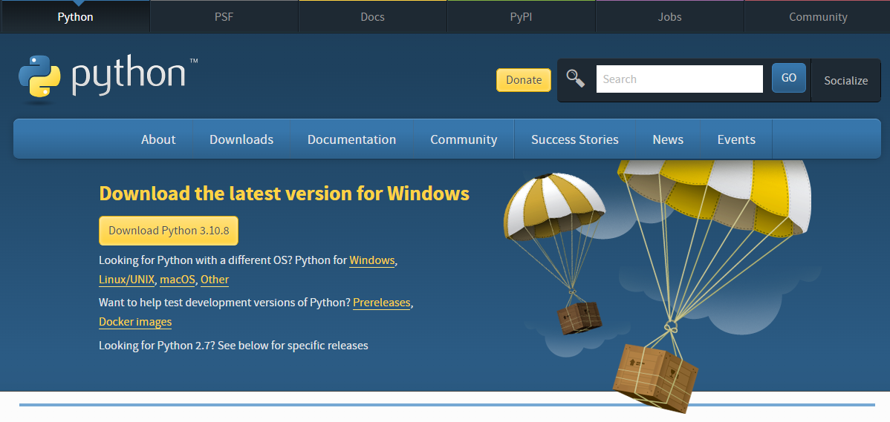
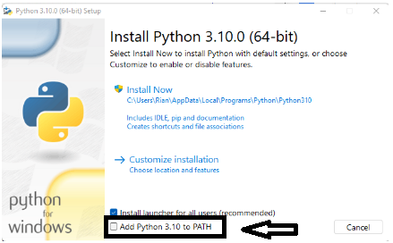
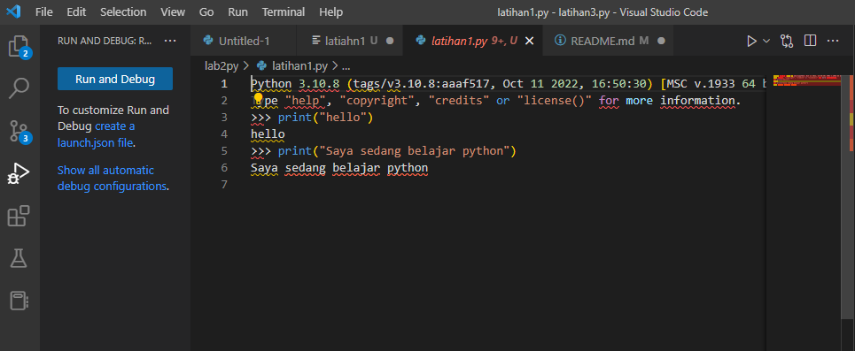
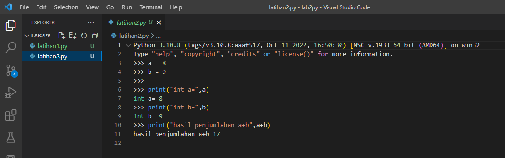

Tugas Pemprograman python

Nama    :Muhamad Ali M

Nim     :312210540

Kelas   :TI 22 B2

# Langkah-Langkah dan penjelasan python

1. Download terlebih dahulu di web resminya [www.python.org](https://www.python.org/downloads/)

2. Setelah download selesai, install aplikasinya

<strong>centang bagian "Add python.exe to PATH"<strong>

3. Setelah Vscode di install jalankan Aplikasinya dan install Extension Python

# LATIHAN 1
• Menjalankan Python Console
• Menampilkan tulisan “Hello” dilayar
• Menampilkan tulisan “Saya sedang belajar python” dilayar

# LATIHAN 2
• Menjumlahkan dua buah bilangan menggunakan variabel a dan b.
• Mendefinisikan variable a dengan nilai 8
• Mendefinisikan variable b dengan nilai 9
• Mencetak nilai variable a dan b
• Mencetak hasil penjumlahan a+b

# LATIHAN 3

#input nilai variabel
a = input("masukan nilai a: ")
b = input("masukan nilai b: ")

#cetak nilai variabel
print("variabel a = ", a)
print("variabel b = ", b)

#cetak hasil kedua operasi variabel dengan string format
print("Hasil Penggabungan {1} & {0} = ".format(a,b) + str(a)+str(b))

#konversi nilai variabel 
a = int(a);
b = int(b);

print("Hasil penjumlahan {1} + {0} = %d".format(a,b) %(a+b))
print("Hasil pembagian {1} / {0} = %d".format(a,b) %(a/b))

